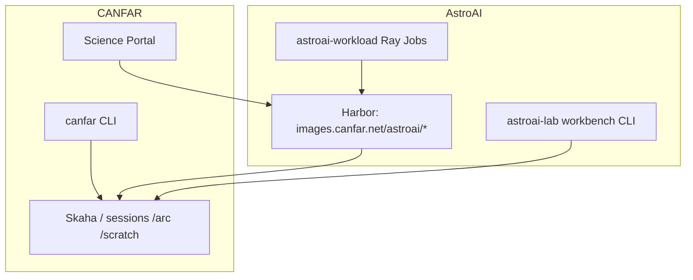

# AstroAI containers

Session images for astronomy and ML on the
[CANFAR Science Platform](https://www.opencadc.org/canfar/).
Images publish to Harbor as `images.canfar.net/astroai/<image>:<tag>`.

Licensed under [BSD-2-Clause](LICENSE).



## Names at a glance

| Name | Meaning |
|------|---------|
| **AstroAI** | This product: GitHub [`astroai`](https://github.com/astroai), Harbor project `astroai`, images and tools |
| **CANFAR** | Hosting platform: portal, Skaha, auth, `/arc`, scheduling |
| **`canfar`** | Platform CLI — login, create/list/delete sessions |
| **`astroai-lab`** | In-session workbench (vendored into these images) |
| **`images.canfar.net/astroai/*`** | AstroAI images on CANFAR Harbor (host ≠ product name) |

## Sessions

| Image | Use for | Skaha type |
|-------|---------|------------|
| `webterm` | Browser terminal (ttyd + tmux) | Contributed |
| `vscode` | Browser IDE (OpenVSCode Server) | Contributed |
| `notebook` | JupyterLab | Notebook |
| `marimo` | Reactive notebooks | Contributed |
| `openresearch` | OpenResearch (`orx`) autoresearch dashboard | Contributed |
| `base` | Headless parent (CI / batch) | — |
| `ray-manager` | Ray head + control panel + Dashboard ([RAY.md](docs/RAY.md)) | Contributed |
| `ray-worker` | Ray worker CPU or GPU (manager-launched) | Headless |

## Documentation

| Doc | Audience |
|-----|----------|
| [docs/USAGE.md](docs/USAGE.md) | Session users — first session, storage, tools |
| [astroai-lab USAGE](https://github.com/astroai/astroai-lab/blob/main/docs/USAGE.md) | `astroai-lab` CLI detail |
| [docs/RAY.md](docs/RAY.md) | Ray clusters — manager + workers |
| [docs/CONTRIBUTING.md](docs/CONTRIBUTING.md) | Developers — clone, build, test, PRs |
| [docs/OPERATORS.md](docs/OPERATORS.md) | Maintainers — push, register, smoke tests |

In-session: `astroai-lab guide` · `less /opt/astroai/USAGE.md`

## Build and test

Requires Docker with buildx. Full loop: [CONTRIBUTING.md](docs/CONTRIBUTING.md).

```bash
make build-all              # session stack
make build-ray              # ray-manager + ray-worker
make build/vscode           # one image (+ parents)
make test-local             # local smokes
make test-ray               # local Ray cluster + UI
```

## Push (maintainers)

See [OPERATORS.md](docs/OPERATORS.md). The `astroai` Harbor project is **public**
(anonymous pull); push still needs `docker login images.canfar.net`.

```bash
make push/vscode TAG=26.07
make push-all TAG=26.07
make push-ray TAG=26.07
```

Default `TAG` is current UTC `YY.MM` (for example `26.07`).

## Layout

```
dockerfiles/   python → base → session images; ray-base → manager/worker
ray/           manager FastAPI app + worker helpers
scripts/       startup-*.sh, test-*.sh, profile
vendor/        astroai-lab wheel baked into base
docs/          USAGE, RAY, OPERATORS, CONTRIBUTING
examples/ray/  container-local Ray smokes
```

## Design

- **Same images for CPU and GPU** — choose the node in the portal; CUDA/ML stacks via pixi/uv in the project.
- **Bake graph:** `python` → `base` → `webterm` / `vscode` / `notebook` / `marimo` / `openresearch`; Ray adds `ray-base` → `ray-manager` / `ray-worker` (same `TAG` as `base`).
- **Fast session disks:** `TMP_SRC_DIR` (`/srcdir`) for code, `TMP_SCRATCH_DIR` (`/scratch`) for data and caches; hourly backup + `astroai-lab` persist to `/arc`.
- **Skaha types:** Contributed listen on **5000**; Notebook on **8888**.
- **Auth at the edge:** Session UIs trust CANFAR TLS + portal login. Use these images only behind an authenticating reverse proxy.

Heavy site software: [CVMFS on CANFAR](https://github.com/opencadc/canfar/blob/main/docs/platform/cvmfs.md).

## Related repos

| Repo | Role |
|------|------|
| [astroai-lab](https://github.com/astroai/astroai-lab) | In-session CLI |
| [astroai-workload](https://github.com/astroai/astroai-workload) | Ray Jobs Python helpers |
| [opencadc/canfar](https://github.com/opencadc/canfar) | Platform client |
| [opencadc/science-platform](https://github.com/opencadc/science-platform) | Skaha / Helm (platform team) |

## Contributing

Pull requests welcome — [docs/CONTRIBUTING.md](docs/CONTRIBUTING.md).
