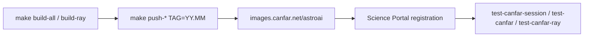
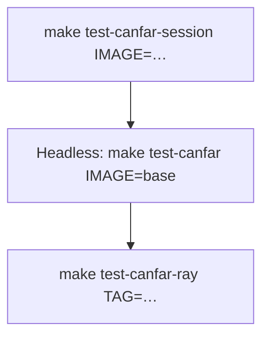

# Operators guide

For **AstroAI maintainers** who build, push, and register
`images.canfar.net/astroai/*` on the CANFAR Science Platform.

Skaha Helm charts and launch scripts live in
[opencadc/science-platform](https://github.com/opencadc/science-platform)
(platform team). This repo owns image build/push and Science Portal registration
inside the Harbor project **`astroai`**.

| Role | Scope |
|------|--------|
| **AstroAI maintainer** | Build, push, register, smoke-test images |
| **CANFAR platform admin** | Skaha Helm, ingress, launch ConfigMaps |



## Images and session types

| Image | Harbor path | Skaha type | Port | Portal? |
|-------|-------------|------------|------|---------|
| `base` | `…/astroai/base:<tag>` | — | — | No (parent / headless verify) |
| `webterm` | `…/astroai/webterm:<tag>` | Contributed | 5000 | Yes |
| `vscode` | `…/astroai/vscode:<tag>` | Contributed | 5000 | Yes |
| `notebook` | `…/astroai/notebook:<tag>` | Notebook | 8888 | Yes |
| `marimo` | `…/astroai/marimo:<tag>` | Contributed | 5000 | Yes |
| `openresearch` | `…/astroai/openresearch:<tag>` | Contributed | 5000 | Yes |
| `ray-manager` | `…/astroai/ray-manager:<tag>` | Contributed | 5000 | Yes |
| `ray-worker` | `…/astroai/ray-worker:<tag>` | Headless | — | No — manager launches |

OCI label `io.canfar.skaha.session.type` marks `headless` / `contributed` / `notebook`.

Register **`ray-manager` only** for Ray. Workers stay headless. See [RAY.md](RAY.md).

Users authenticate once with `canfar login` (credentials under `/arc/home`,
`~/.canfar/config.yaml`). Ray manager sessions reuse that home volume.

## Harbor (`astroai` public project)

Images: `images.canfar.net/astroai/<image>:<tag>`. Keep project **Public** so
anonymous pull works for portal users.

```bash
docker logout images.canfar.net 2>/dev/null || true
docker pull images.canfar.net/astroai/base:latest
```

Push still requires `docker login images.canfar.net`.

Build and publish:

```bash
# BUILD_TAG must match TAG so ray-manager bakes RAY_IMAGE_TAG for workers
make build-all BUILD_TAG=26.07
make push-all TAG=26.07 BUILD_TAG=26.07
make build-ray BUILD_TAG=26.07 TAG=26.07
make push-ray TAG=26.07 BUILD_TAG=26.07
```

Each `push/<image>` publishes `TAG` and **`latest`**. `make push-all` includes
`base`. Prefer monthly **`YY.MM`** tags in production docs.

## Platform boundary

| Session type | Helm template | Container command | AstroAI `/skaha/startup.sh` |
|--------------|---------------|-------------------|-----------------------------|
| **Contributed** | `launch-contributed.yaml` | Image `CMD` | Yes |
| **Notebook** | `launch-notebook.yaml` | Platform `/skaha-system/start-jupyterlab.sh` by default | Only with platform override |
| **Headless** | `launch-headless.yaml` | User command / image `CMD` | Image-dependent |

Contributed ingress strips `/session/contrib/<session-id>` before the container.
Session UIs listen at `/` on port **5000**.

| Image | Proxy / listen notes |
|-------|----------------------|
| `webterm` | Listen `/` — no ttyd `--base-path` |
| `vscode` | `--server-base-path /session/contrib/<id>` for URL generation |
| `marimo` | Listen `/` — **no** `--base-url` (stripped ingress; a base-url would 404) |
| `notebook` | Ingress keeps path; Jupyter `base_url=session/notebook/<id>` |

### Notebook override (platform request)

Stock notebook Jobs skip AstroAI `startup-notebook.sh`. To run the AstroAI
entrypoint, ask the science-platform team for a per-image override that sets
`command: ["/skaha/startup.sh"]` and passes the session id as `args` (port 8888).

## Science Portal checklist

1. Push `images.canfar.net/astroai/*:<tag>`.
2. Register Contributed: `webterm`, `vscode`, `marimo`, `ray-manager` → port **5000**.
3. Register Notebook: `notebook` → port **8888**.
4. Leave `base` and `ray-worker` off the interactive catalog.
5. Document the published tag for users (`YY.MM`).

## Local smoke

```bash
make build/webterm
./scripts/test-local.sh webterm 5000
make build/notebook
./scripts/test-local.sh notebook 8888
```

## Post-push verification on CANFAR

Requires authenticated [`canfar`](https://opencadc.github.io/canfar/) (`canfar login`).



**Interactive HTTP smoke** (works when headless scheduling is unhealthy):

```bash
make test-canfar-session IMAGE=webterm TAG=26.07
make test-canfar-session IMAGE=vscode TAG=26.07
make test-canfar-session IMAGE=marimo TAG=26.07
make test-canfar-session IMAGE=notebook TAG=26.07
```

**Headless in-image verify** (`canfar-verify.sh`):

```bash
CANFAR_TEST_QUICK=1 make test-canfar IMAGE=base TAG=26.07
```

`test-canfar.sh` waits for completion and expects `All checks passed.` in logs.
If status stays **Pending** with no Start Time for `CANFAR_PENDING_STUCK_SECS`
(default **120**), the script fails fast. Note: this is the documented
upstream **Skaha headless-scheduling flake**
([opencadc/science-platform#1124](https://github.com/opencadc/science-platform/issues/1124)),
**not** a concurrent-session quota lock — session quotas do not apply to
headless kinds. (See [Platform notes](#platform-notes-headless-pending).)

**Ray:**

```bash
make test-canfar-ray TAG=26.07
make test-canfar-ray-gpu TAG=26.07
```

Create ray-manager with **≥8 GiB** when exercising Ray Jobs / Dashboard (smaller
managers often OOM). Details: [RAY.md](RAY.md).

## Platform notes (headless Pending)

Intermittent Skaha **headless** sessions can remain Pending indefinitely
(Start Time / Connect URL unknown) while contributed and notebook sessions start
for the same user. That blocks `test-canfar.sh` worker probes and Ray preflight.

Tracked upstream:
[opencadc/science-platform#1124](https://github.com/opencadc/science-platform/issues/1124).

While headless is unhealthy:

1. Prefer `make test-canfar-session` for contributed/notebook gates.
2. Set `CANFAR_RAY_SKIP_PREFLIGHT=1` to exercise Ray manager UI without the probe.
3. Keep concurrent contributed/notebook sessions low. Headless kinds are
   **quota-exempt** — a stuck Pending headless job is the Skaha scheduling
   flake, not a quota lock. Prune only for hygiene, not to free quota slots.

## Diagnostics users can share

| Command | Use |
|---------|-----|
| `astroai-lab doctor --json` | Paths, caches, tools, auth probe |
| `astroai-lab status --json` | Quotas, projects, `canfar ps` |

Doctor fails the process when **cache environment variables still point at `$HOME`**
while leftovers on disk under home are reported as warnings.

## Agents and quota (operator view)

- Agents install on demand via `astroai-lab agent install` into scratch/`ASTROAI_LAB_BIN_DIR` — prefer that over baking agent binaries into images.
- Quota warnings fire at session start and via `astroai-lab status` (≈80 / 90 / 95%).
- User data lifecycle (`push`, `data stage|sync`) is documented for users in [USAGE.md](USAGE.md).

## User-facing docs

Point end users at [USAGE.md](USAGE.md) (also `/opt/astroai/USAGE.md` in sessions).
