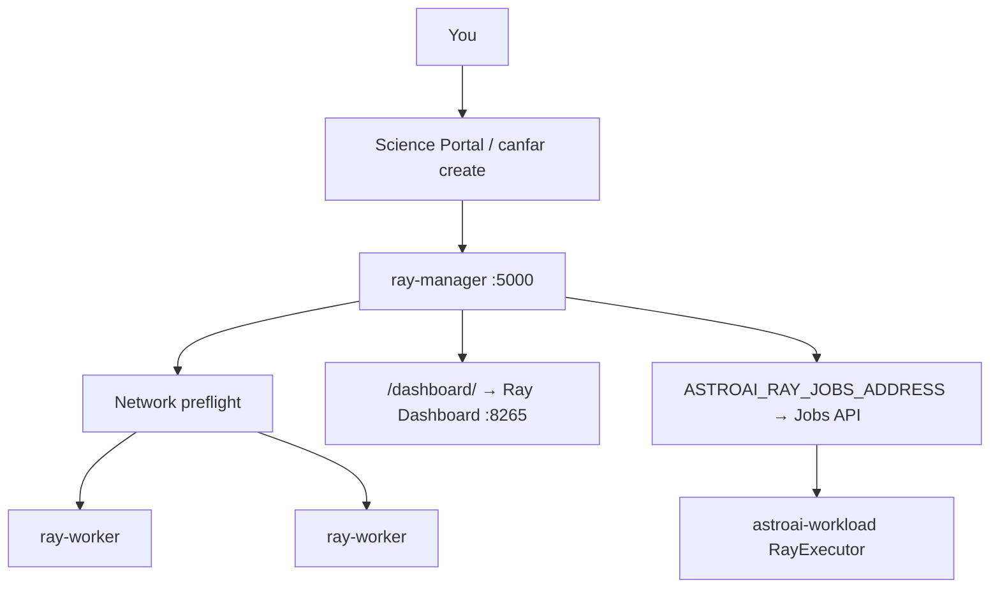
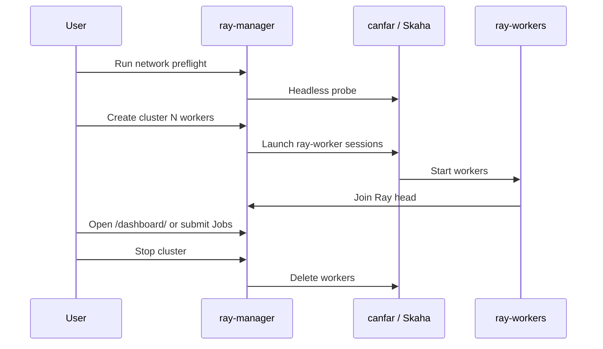

# Distributed Ray on AstroAI (CANFAR)

User-owned Ray clusters: a **contributed `ray-manager`** session launches
**headless `ray-worker`** sessions over pod networking. Images are published as
`images.canfar.net/astroai/ray-manager:<tag>` and
`images.canfar.net/astroai/ray-worker:<tag>`.



## Prefer

| Path | Why |
|------|-----|
| Stock **Ray Dashboard** at `connectURL/dashboard/` | Jobs, actors, nodes, logs |
| Manager control panel at `/` | Auth, preflight, create/stop cluster |
| [`astroai-workload`](https://github.com/astroai/astroai-workload) or Dashboard Jobs | Submit training entrypoints |
| One `ray-worker` image | Request `gpus=N` per worker; CPU and GPU share the image |

The FastAPI control panel is feature-frozen for stability (`ray/manager/FROZEN.md`).
ML/CUDA stacks live in user pixi/uv projects. Spill/temp need **`/scratch`** on
every node. Persist cluster state under `/arc/home/<user>/` or
`/arc/projects/<group>/` — not the `/arc` mount root.

## Images

| Image | Skaha type | Portal |
|-------|------------|--------|
| `ray-manager` | Contributed | Register — users launch this |
| `ray-worker` | Headless | Manager launches workers |
| `ray-base` | Build-only | Parent with Python 3.12 Ray venv |

## Build and test

```bash
make build-ray BUILD_TAG=26.07
make test-ray
make push-ray TAG=26.07
make test-canfar-ray TAG=26.07
make test-canfar-ray-gpu TAG=26.07
```

Ray layers use the **same bake `TAG` as `base`**.

For Jobs / Dashboard on CANFAR, start the manager with **≥8 GiB** memory.

If headless probes hang Pending, see
[OPERATORS.md — platform notes](OPERATORS.md#platform-notes-headless-pending)
or set `CANFAR_RAY_SKIP_PREFLIGHT=1` for UI-only checks.

## Authentication

From any AstroAI session (webterm/vscode):

```bash
canfar login
```

Credentials persist as `~/.canfar/config.yaml` (and optionally
`~/.ssl/cadcproxy.pem`) on `/arc/home`. The manager reuses that volume to launch
workers via the `canfar` Python client.

For maintainer headless pulls when required:

```bash
canfar config set registry.url https://images.canfar.net
canfar config set registry.username <harbor-user>
canfar config set registry.secret <harbor-cli-secret>
```

## Network preflight

Preflight starts a headless probe and checks **worker→manager** TCP on Ray ports
(6379–6381). Manager→worker samples against the probe pod are not used (the probe
never listens on Ray ports).

| Outcome | Meaning |
|---------|---------|
| Probe stays **Pending** | Headless scheduling issue — [science-platform#1124](https://github.com/opencadc/science-platform/issues/1124) |
| `worker→manager` checks fail | Session-to-session network isolation on the platform |
| Worker log: cannot reach head `:6379` | Same networking class after the worker starts |

Preflight results are bound to the manager pod IP. Creating a cluster after moving
to a new manager session requires a fresh preflight.

## Web UI

Contributed **`ray-manager`** serves port **5000** under
`/session/contrib/<session-id>/` (prefix stripped before the container).

| Surface | Purpose |
|---------|---------|
| `/` | Auth, preflight, create/stop cluster, worker table |
| `/dashboard/` | Official Ray Dashboard (proxy to `127.0.0.1:8265`) |
| `/actions/*` | Form POSTs for cluster lifecycle |
| `/api/v1/*` | JSON automation |

Always open the Dashboard **with a trailing slash**, using the session connect
URL (`…/dashboard/`), not a bare workloads hostname.

On the manager pod, Jobs clients use **`ASTROAI_RAY_JOBS_ADDRESS`**
(`http://127.0.0.1:8265`).

Local UI smoke: `./scripts/test-ray-ui-local.sh` (part of `make test-ray`).

## Cluster workflow



1. **Run network preflight**
2. **Create cluster** — worker count, CPU/RAM, GPUs per worker, `min_joined`, partial-start policy
3. **Use Ray** — Dashboard, `ray.init(address="auto")` on the manager, or Jobs / `astroai-workload`
4. **Stop cluster** — destroys worker sessions

Partial-start policies: `accept_partial`, `fail_and_cleanup`, `continue_waiting`.

State lives at `~/.astroai/ray/clusters/<cluster-id>/state.json` (worker logs archived
beside it). Each manager session defaults `RAY_CLUSTER_ID` to `mgr-<skaha_sessionid>`
so a new manager does not inherit another pod’s `default` state on shared `/arc/home`.
Override `RAY_CLUSTER_ID` for a stable team path under `/arc/projects` if needed.
On manager start, terminal-phase leftovers are destroyed (startup GC); **Reconcile
state** refreshes membership for an active cluster after restart.

## Manager API

| Endpoint | Purpose |
|----------|---------|
| `GET /api/v1/auth/status` | Credential check |
| `POST /api/v1/preflight/run` | Network preflight (`?async=1`) |
| `POST /api/v1/cluster/create` | Launch workers (`?async=1`) |
| `POST /api/v1/cluster/stop` | Stop and destroy workers |
| `POST /api/v1/cluster/reconcile` | Refresh state |
| `POST /api/v1/cluster/clean-orphans` | Destroy untracked workers |
| `POST /api/v1/workers/{id}/retry` | Retry a failed worker |
| `GET /api/v1/status` | Full cluster JSON |
| `GET /api/v1/workers/{id}/logs` | Archived worker logs |

## Layout

```
ray/manager/                 FastAPI + cluster lifecycle
ray/worker/                  Worker entrypoint helpers
scripts/test-ray-*.sh        Local and CANFAR tests
examples/ray/                Container smokes
```

## Related

- [USAGE.md](USAGE.md) — general sessions
- [OPERATORS.md](OPERATORS.md) — publish and platform notes
- [astroai-workload](https://github.com/astroai/astroai-workload) — Jobs helpers + MNIST example
- Starter notebook in-image: `/opt/astroai/notebooks/ray_train.ipynb`
