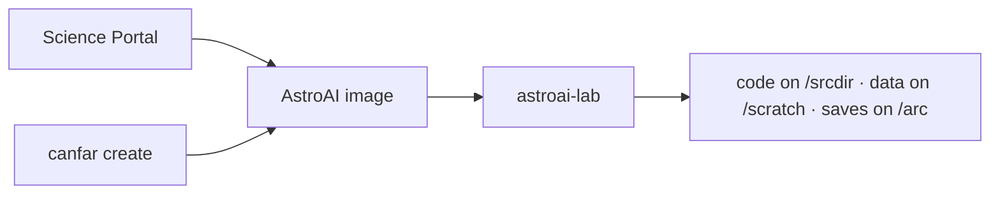
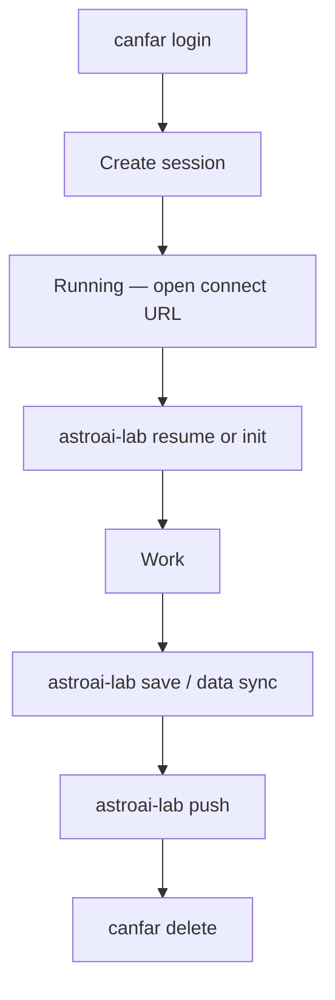

# Session user guide

How to use **AstroAI** session images on the
[CANFAR Science Platform](https://www.opencadc.org/canfar/).

This file ships inside images as `/opt/astroai/USAGE.md`.

| You want… | Read |
|-----------|------|
| This page | First session, storage, tools, troubleshooting |
| `astroai-lab` command detail | [astroai-lab USAGE](https://github.com/astroai/astroai-lab/blob/main/docs/USAGE.md) |
| Ray clusters | [RAY.md](RAY.md) |
| Platform CLI | [opencadc.github.io/canfar](https://opencadc.github.io/canfar/) |

## Names

| Name | Meaning |
|------|---------|
| **AstroAI** | Product images and tools (`images.canfar.net/astroai/*`) |
| **CANFAR** | Platform: [Science Portal](https://www.canfar.net/science-portal), Skaha, `/arc` |
| **`canfar`** | CLI for login and sessions |
| **`astroai-lab`** | Workbench **inside** a running session |



---

## Student checklist (notebook-first)

1. Open the [Science Portal](https://www.canfar.net/science-portal).
2. Launch **notebook** (JupyterLab) or **marimo**.
3. Open starter content:
   - Notebook: `/opt/astroai/notebooks/starter.ipynb` or `astroai-lab notebook starter`
   - Marimo: session opens `TMP_SRC_DIR/notebooks/starter.py` (seeded once)
4. Run `astroai-lab kernel ensure` if the kernel is missing (notebook).
5. Run `astroai-lab doctor` — caches should sit under `/scratch`.
6. Persist results to `/arc/projects/…` with `astroai-lab data sync` or `vcp`.

---

## Your first session

### From the portal

1. Log in at [canfar.net/science-portal](https://www.canfar.net/science-portal).
2. Pick an AstroAI image (`webterm`, `vscode`, `notebook`, `marimo`, `openresearch`, or `ray-manager`).
3. Choose resources (CPU / memory / GPU node as needed).
4. Open the connect URL when the session is **Running**.

### From the `canfar` CLI

```bash
canfar login
canfar create --name myterm webterm
# or a tagged Harbor image:
canfar create --name myterm contributed images.canfar.net/astroai/webterm:26.07
canfar ps
canfar open <session-id>
```

Inside the session:

```bash
astroai-lab                # status
astroai-lab guide          # cheat sheet
astroai-lab init mylab
astroai-lab push --yes     # before you delete the session
```



---

## How storage works

| Tier | Path | Lifetime | Use |
|------|------|----------|-----|
| Work | `TMP_SRC_DIR` → `/srcdir` | Session | Source, pixi/uv projects |
| Scratch | `TMP_SCRATCH_DIR` → `/scratch` | Session | Data, package caches, temp |
| Home | `/arc/home/<you>` | Persistent | Config, env saves, credentials |
| Projects | `/arc/projects/<group>` | Persistent | Shared datasets and results |

```bash
astroai-lab paths
astroai-lab data stage /arc/projects/mygroup/raw
astroai-lab data sync /scratch/out /arc/projects/mygroup/out
```

Env snapshots: `astroai-lab save` / `resume` → default `~/.astroai/lab/saves/`.

**Automatic work backup:** sessions start an hourly rsync of `/srcdir` →
`~/.astroai/lab/backups/<session-id>/` on `/arc/home`. Check with
`astroai-lab backup status`. Opt out: `ASTROAI_LAB_BACKUP_ENABLED=false`.

Team layout: `astroai-lab project init <group> --members …`

---

## CADC and VOSpace

Session images include CADC clients on PATH (`/opt/astroai/venv/cadc`):

```bash
cadcget …
vls vos:…
vcp ./file.fits vos:…
canfar login          # platform auth (also used by Ray manager)
```

Upgrade platform CLIs for this session only:

```bash
upgrade-cadc-tools.sh list
upgrade-cadc-tools.sh --upgrade astroai-lab
```

---

## Alliance software (CVMFS)

On CANFAR compute nodes you can load software modules from CVMFS. See the
platform notes:
[CVMFS documentation](https://github.com/opencadc/canfar/blob/main/docs/platform/cvmfs.md).

---

## Package managers

Use **pixi** or **uv** under `TMP_SRC_DIR` for project dependencies. Images stay
lean: compilers, CUDA, and science stacks belong in your project locks, not in
the Docker layer.

```bash
astroai-lab init mylab          # pixi by default
astroai-lab init mylab --uv
```

---

## AI coding tools

```bash
astroai-lab agent setup
astroai-lab agent install kilo    # goose, cline, opencode, …
astroai-lab agent models free
gh auth login
```

Agents and MCP config persist on `/arc` home. Refresh after image upgrades with
`astroai-lab agent update`. Command detail:
[astroai-lab cli.md](https://github.com/astroai/astroai-lab/blob/main/docs/cli.md).

---

## Marimo notebook sessions

The **marimo** image (`images.canfar.net/astroai/marimo`) provides a reactive
notebook editor on port 5000. Marimo notebooks are plain `.py` files — easy to
git and review.

### First open

On launch, the session opens **`starter.py`** when it is the only notebook under
`TMP_SRC_DIR/notebooks` (seeded once from the image; your edits are never
overwritten). If you already have other `.py` notebooks there, marimo opens the
folder home so you can pick a file. The starter shows session status, file
browsing, Vault access, and short `astroai-lab` command snippets.

**Existing project:**

1. In a **webterm**: `astroai-lab init mylab` or `astroai-lab clone owner/repo`
   (projects land under `TMP_SRC_DIR`).
2. In marimo: **File → Open** and browse into that folder. Symlinks
   `📁_scratch`, `📁_srcdir`, `📁_arc` sit next to `starter.py`. The starter’s
   **Session status** cell also lists detected projects under work.

Re-seed the template anytime: `astroai-lab notebook starter marimo`.

### Jupyter → Marimo quick guide

| Jupyter habit | Marimo equivalent |
|--------------|-------------------|
| **Run cell** (Ctrl+Enter) | Nothing — marimo is always running |
| **Run All** | Already done — every cell is always up-to-date |
| **File browser sidebar** | `File > Open` (Cmd/Ctrl+O), or the **Session Files** widget in the starter |
| **Terminal** | Open a **webterm** session in another tab |
| **Extensions / plugins** | No plugin system — starter runs read-only `astroai-lab` checks; mutating commands stay in webterm |
| **`.ipynb` files** | Marimo uses `.py` files; convert with `marimo convert notebook.ipynb` |

### Session file browser

The starter includes a **Session Files** widget for `/scratch`, `/srcdir`, and
`/arc`. For quick access from `File > Open`, use the `📁_*` symlinks in the
notebooks directory.

### VOSpace / Vault

**Today (interim):** the starter’s **CANFAR Vault** widget lists and downloads
`vos:` paths. The `vos` module is pre-installed — authenticate with
`canfar login` in a webterm first. CLI: `vls` / `vcp`.

**Next:** when the `vos` client ships **fsspec** support, expose a notebook
filesystem variable so marimo’s built-in **Remote Storage** panel discovers
Vault (same pattern as S3/GCS). Until then, do not expect Vault under
**Add remote storage**.

Reusable widgets:

```python
from canfar_marimo import file_browser, vospace_controls

fb = file_browser()
fb  # last expression so it renders

vc = vospace_controls()
vc.panel  # inputs + buttons

# dependent cell — references vos_* globals or vc.result_md()
vc.result_md()
```
### astroai-lab in marimo

The starter’s **Session status** cell runs read-only checks (`env export`,
`doctor --json`) and lists projects. For **init / clone / save / push / agent
install**, use a **webterm** tab:

**First session / new project**

```bash
astroai-lab init mylab              # pixi (recommended)
astroai-lab init mylab --uv
astroai-lab clone owner/repo
astroai-lab clone owner/repo --from-env
```

**Persist before logout**

```bash
astroai-lab save
astroai-lab data sync /scratch/out /arc/projects/mygroup/out
astroai-lab push --yes
```

**AI agents** (config on `/arc/home`)

```bash
astroai-lab agent setup             # once per user (also seeds marimo AI)
astroai-lab agent install kilo      # or goose, claude, opencode, codex
astroai-lab agent update
```

Full reference: `astroai-lab guide` · [astroai-lab docs](https://github.com/astroai/astroai-lab)

### Marimo AI Assistant

Marimo includes a built-in AI sidebar for chat, code generation, and cell
refactoring. It's pre-configured to use **OpenRouter** — the same provider
your `astroai-lab` agents use.

**Setup (one-time):**

```bash
# In a webterm tab:
astroai-lab agent setup
```

This stores your OpenRouter API key on `/arc/home`. Marimo picks it up
automatically on subsequent sessions. The default `~/.marimo.toml` is seeded
on first launch with OpenRouter pre-configured.

**Using the AI:**

- **AI sidebar**: Click the AI button in the toolbar, or press
  **Cmd/Ctrl+Shift+E** to refactor the current cell.
- **Chat / Agent modes**: Ask questions, let the AI edit cells, or generate
  new cells from prompts.
- **Data-aware prompts**: Type `@variable_name` to pass in-memory DataFrames
  and variables directly to the AI.

**Customize models** via `~/.marimo.toml` or the settings panel in the
chat sidebar. The default config uses:
- Chat: `google/gemini-2.5-flash`
- Edit: `anthropic/claude-3.7-sonnet`

If the AI sidebar shows "No API key configured," run `astroai-lab agent setup`
in a webterm and restart your marimo session.

---

## OpenResearch (autoresearch)

The **openresearch** image (`images.canfar.net/astroai/openresearch`) runs the
[OpenResearch](https://openresearch.sh/) local dashboard (`orx up`) as a
contributed session on port **5000**.

1. Launch **openresearch** from the portal (or `canfar create … contributed images.canfar.net/astroai/openresearch:<tag>`).
2. Open the Connect URL — you get the `orx` UI (agent chat, experiment tree, Autoresearch).
3. Install a harness if needed (once, persists on `/arc/home`):
   ```bash
   # from a webterm, or the openresearch session shell if available
   astroai-lab agent install claude   # or codex / opencode
   ```
4. In the UI, pick Claude Code / Codex / OpenCode and give Autoresearch a goal
   against your project under `/srcdir`.
5. Optional cloud features: `orx login` (stores token under `~/.config/openresearch/`).

Work under `/srcdir` is still ephemeral — the hourly backup and `astroai-lab push`
cover persistence. Prefer GPU nodes for training loops.

---

## Session notes

| Image | Port / path notes |
|-------|-------------------|
| `webterm` | Contributed `:5000` — ttyd + tmux |
| `vscode` | Contributed `:5000` — OpenVSCode; base-path set for `/session/contrib/<id>/` |
| `marimo` | Contributed `:5000` — listens at `/` (ingress strips the contrib prefix) |
| `openresearch` | Contributed `:5000` — `orx` on loopback `:4791`, proxied to `:5000` |
| `notebook` | Notebook `:8888` — Jupyter `base_url` is `session/notebook/<id>` |
| `ray-manager` | See [RAY.md](RAY.md) — Dashboard at `connectURL/dashboard/` |

CPU and GPU use the **same** image; request a GPU node in the portal when needed.

---

## Environment variables

| Variable | Set by | Meaning |
|----------|--------|---------|
| `TMP_SRC_DIR` | Skaha | Work directory (default `/srcdir`) |
| `TMP_SCRATCH_DIR` | Skaha | Scratch (default `/scratch`) |
| `skaha_sessionid` | Skaha | Session id (proxy paths) |
| `ASTROAI_LAB_*` | Optional | Workbench overrides — [config.md](https://github.com/astroai/astroai-lab/blob/main/docs/config.md) |
| `ASTROAI_RAY_JOBS_ADDRESS` | ray-manager startup | Local Jobs API (`http://127.0.0.1:8265`) |

Login shells load AstroAI profile helpers so caches prefer scratch.

---

## Diagnostics

```bash
astroai-lab doctor --json
astroai-lab status --json
astroai-lab check --strict
astroai-lab tools
```

---

## Troubleshooting

| Symptom | Action |
|---------|--------|
| Lost files after session end | They were on `/srcdir` or `/scratch` — check `~/.astroai/lab/backups/` or sync to `/arc` next time before exit |
| Home quota full | `astroai-lab status`; `astroai-lab clean home --all-safe --dry-run` |
| Caches under `$HOME` | Use a login shell; `astroai-lab doctor` |
| Session stuck **Pending** | Check `canfar ps` / `canfar events`. Stuck **contributed/notebook** sessions consume the (≈3) session quota — prune to free slots. **Headless kinds are quota-exempt** — a Pending headless is the [Skaha scheduling flake](OPERATORS.md#platform-notes-headless-pending), not a quota issue |
| Marimo / UI 404 | Confirm connect URL trailing path; contrib ingress strips `/session/contrib/<id>` |
| Need Ray | Follow [RAY.md](RAY.md); manager memory **≥8 GiB** for Jobs/Dashboard |

---

## Related

- [astroai-lab](https://github.com/astroai/astroai-lab) — detailed CLI
- [astroai-workload](https://github.com/astroai/astroai-workload) — Ray Jobs from Python
- [OPERATORS.md](OPERATORS.md) — maintainers
- [CONTRIBUTING.md](CONTRIBUTING.md) — image development
